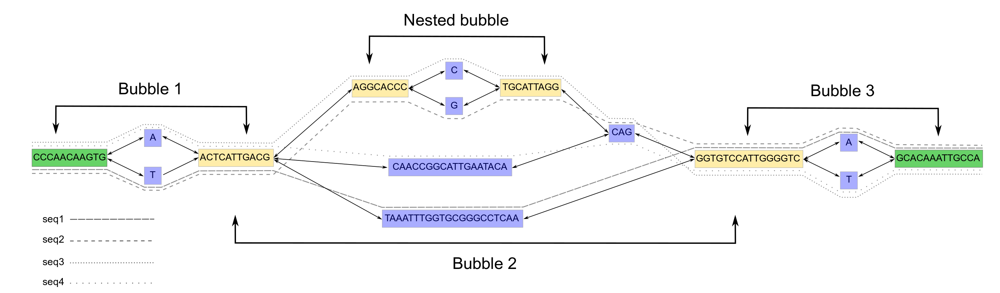

.. _bubbles:

Calculating Bubbles
====================

`BubbleGun <https://github.com/fawaz-dabbaghieh/bubble_gun>`_ is a tool that identifies topological structures in a graph (GFA file).
These topological structures can be nested within each other, forming a hierarchical chain of superstructures.

.. note::
    BubbleGun is bundled with PangyPlot (vendored under ``BubbleGun/`` at the repo root) and is invoked automatically during ``pangyplot add``. You do not need to install it separately. This section is for informational purposes.

Structure Definitions
~~~~~~~~~~~~~~~~~~~~~~~~

.. raw:: html

  

    

      <i class="fa-regular fa-square"></i>
      

        
Segment

        
a contiguous chunk of sequence with no variation. Basic nodes that make up a graph genome.

      

    

    

      <i class="fa-regular fa-circle"></i>
      

        
Bubble

        
An acyclic, directed subgraph with source and sink nodes. All paths through the bubble must touch the source and sink nodes.

      

    

    

      <i class="fa-solid fa-arrow-right-to-bracket"></i>
      

        
Bubble Source/Sink

        
The entry and exit points of a bubble.

      

    

    

      <i class="fa-solid fa-chain"></i>
      

        
Bubble Chain

        
A sequence of bubbles where the sink of one directly connects to the source of the next, forming a larger structure.

      

    

    

      <i class="fa-solid fa-boxes-stacked"></i>
      

        
Compacted Graph

        
A genome graph simplified by merging consecutive, non-branching segments into single nodes while preserving all variation points.

      

    

  

   From the `BubbleGun publication <https://doi.org/10.1093/bioinformatics/btac448>`_. 

Compacting the Graph
~~~~~~~~~~~~~~~~~~~~~~~~

Compacting the graph before bubble detection removes long stretches of trivial, non-branching nodes. Without compaction, these nodes artificially break up bubblechains, making bubbles look smaller or fragmented. By merging them, bubble sources and sinks become clear, bubble boundaries are preserved, and bubblechains reflect the true size of the underlying variation. This also reduces graph noise and improves performance.

PangyPlot will attempt to compact the graph during bubble detection so that bubble chains aren't disrupted. The data is still stored uncompacted, which means that bubble sources and sinks may contain multiple uncompacted segments.

