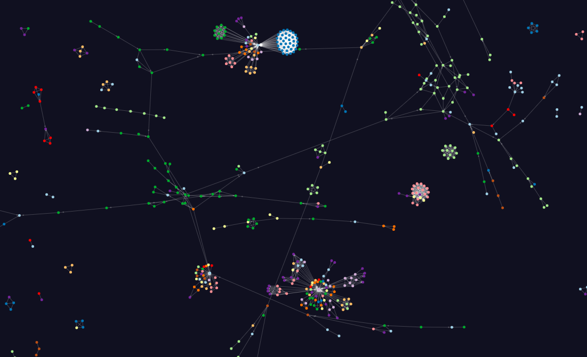
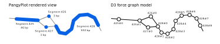

.. _forcegraph:

Rendering with D3 Force-directed Graphs
=======================================

PangyPlot uses a `force-graph library <https://github.com/vasturiano/force-graph>`_ that is built on `d3-force <https://github.com/d3/d3-force>`_ to render the graph.
D3 is a popular JavaScript library for producing dynamic, interactive data visualizations in web browsers.

   Example image from the `force-graph <https://github.com/vasturiano/force-graph>`_ GitHub repository.

Node Types
~~~~~~~~~~~~~~~~~~~

.. figure:: ../_images/graph/segments.svg
   :alt: segments
   :align: center
   :width: 100%

   Segments = ``S`` lines from GFA files (blue). Links = ``L`` lines from GFA files (gray).

.. figure:: ../_images/graph/bubble_chain.svg
   :alt: bubble and chain
   :align: center
   :width: 100%

   A chain of bubbles. Each bubble in the chain is shown in yellow, the chain links are orange. 

Implementation
~~~~~~~~~~~~~~

PangyPlot splits up longer segments into a series of connected force-graph nodes, using thickly drawn links to give the illusion of length. 

   How nodes are implemented.

Codebase Overview
-------------------

In the code, functionality is added to the force-graph library via "engines": 

``pangyplot/static/js/graph/engines/``

Forces that help optimize the layout include are here: 

``pangyplot/static/js/graph/forces/``

Rendering functionality is found here: 

``pangyplot/static/js/graph/render/``

These scripts either override or extend the default force-graph behavior.
