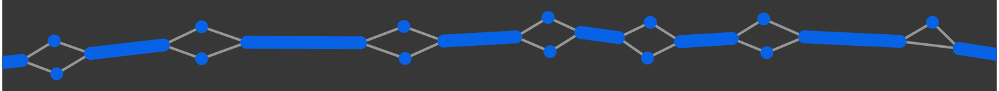
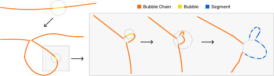
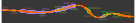

.. _visuals:

Viewing the Pangenome
==================================

Node Types
~~~~~~~~~~~~~~~~~~~

   Segments = ``S`` lines from GFA files (blue). Links = ``L`` lines from GFA files (gray).

   A chain of bubbles. Each bubble in the chain is shown in yellow, the chain links are orange. 

PangyPlot First displays top-level bubbles. Bubbles can be popped to reveal finer-scale details.

   Iterative bubble popping to the segment level.

Gene Annotations
~~~~~~~~~~~~~~~~~~~

The gene annotations are provided during setup up PangyPlot. The HPRC live instance uses annotations from `GENCODE <https://www.gencodegenes.org/human/>`_ (any GFF3 file can be used).

Annotations are rendered as outlines around nodes and edges:

   Example of rendered gene annotations.

Interactions
~~~~~~~~~~~~~~~~~~~

.. raw:: html

   

      

         <i class="fa-solid fa-up-down-left-right"></i>
         

            
Pan/Zoom Mode <code>default</code>

            
Click and drag to pan the view. Use mouse wheel to zoom in and out.

         

      

      

         <i class="fa-solid fa-hand-pointer"></i>
         

            
Bubble Pop Mode <code>ctrl key</code>/<code>cmd key</code>

            
Click nodes to pop bubbles.

         

      

      

         <i class="fa-solid fa-arrow-pointer"></i>
         

            
Selection Mode <code>shift key</code>

            
Click nodes to select. Drag to create a selection rectangle.

         

      

      

         <i class="fa-solid fa-arrows-to-circle"></i>
         

            
Recenter on Subgraph <code>space bar</code>

            
Press the space bar to recenter the view on the full subgraph.

         

      

      

         <i class="fa-solid fa-arrows-to-dot"></i>
         

            
Recenter on Selection <code>up arrow</code>

            
Press the up arrow key to recenter the view on the selected nodes.

         

      

      

         <i class="fa-solid fa-anchor"></i>
         

            
Anchor on Drag <code>F key</code>

            
Press the F key to toggle whether a node position is fixed after dragging.

         

      

   

Right-Click Menu
~~~~~~~~~~~~~~~~~~~

The right-click menu is context-sensitive: the available actions depend on what
is under the cursor and whether you have a selection.

Right-click a chain to act on it:

.. raw:: html

   

      

         <i class="fa-solid fa-right-left"></i>
         

            
Flip Chain

            
Reverse the orientation of the chain.

         

      

      

         <i class="fa-solid fa-burst"></i>
         

            
Pop All Bubbles

            
Expand every bubble along the chain.

         

      

      

         <i class="fa-solid fa-tag"></i>
         

            
Add Custom Annotation

            
Name and label the chain (or the current selection).

         

      

   

   

With a set of chains highlighted (:code:`Shift`-drag to select), act on the selection:

.. raw:: html

   

      

         <i class="fa-solid fa-clipboard"></i>
         

            
Copy Approx Coordinates

            
Copy the coordinate range spanned by the selection.

         

      

      

         <i class="fa-solid fa-burst"></i>
         

            
Pop Highlighted

            
Expand every bubble within the selection.

         

      

      

         <i class="fa-solid fa-file-export"></i>
         

            
Export GFA

            
Export the selected region as a GFA file (detail view).

         

      

   

   

Export the current view (always available):

.. raw:: html

   

      

         <i class="fa-solid fa-download"></i>
         

            
Download PNG

            
Save the current view as a PNG image.

         

      

      

         <i class="fa-solid fa-download"></i>
         

            
Download SVG

            
Save the current view as an SVG vector image.

         

      

   

