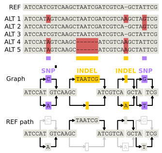
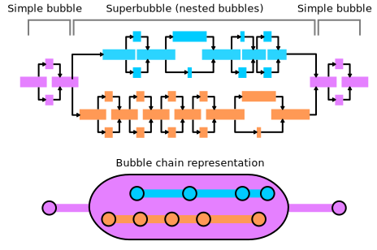

.. _principles:

Core Concepts
==================================

Motivation for PangyPlot
------------------------

A visual interface is fundamental for detecting patterns and gaining meaningful insights into large, complex genomic datasets.
Pangenomes typically rely on a graph-based data structure, which is very difficult to interpret without a visualization of the graph topology.

   Contrasting linear alignments to a variation graph.

Graph genomes are particularly challenging to analyze because they include billions of base pairs and encompass all the potential variations within them.
The range of variation size is also large. For instance, examining the relationship between a SNP and a 20kb structural variant represents a 20,000-fold difference in scale.

Ideally, a visualization tool should allow users to explore the entire graph at multiple levels of detail, from a high-level overview down to individual nucleotides similar to how map applications can handle both global and street-level views.

Managing Millions of Nodes and Edges
------------------------------------

Pangenome graphs contain massive volumes of data, often hundreds of millions of segments and links. 
PangyPlot uses a combination of SQLite databases and in-memory data structures to efficiently manage and query this information, see :ref:`schema`.

Optimizing Layout
-----------------

Visualizing pangenome graphs requires organizing the graph into two dimensions. 
The initial x-coordinate and y-coordinate positions are computed in advance, see :ref:`layout`.
Dynamic web-based graph rendering and physics are powered by a force-directed graph engine, see :ref:`forcegraph`.

Balancing Large and Small Variants
----------------------------------

PangyPlot captures common topological patterns in graph genomes and builds a hierarchical structure of the variation in the genome.
This allows users to control the level of detail visible and also limits the computation necessary to view large regions by abstracting the details.

Complex variation such as structural variants (SVs) coexists with smaller variants like SNPs and indels, and it can be difficult to visualize them together, see :ref:`bubbles`.

   Bubble and bubble chain structures in a pangenome graph.

Coordinate Systems and Annotations
----------------------------------

Genomic coordinate systems are essential for querying and aligning biological features. 
While pangenomic data does not inherently have a primary coordinate system, PangyPlot was developed under a design philosophy that requires one. 
When uploading a graph, users designate a primary path to serve as the coordinate reference system, see :ref:`pangyplot-add`.

With coordinates established, standard GFF3 annotation files can be imported to enable feature visualization and biological interpretation, see :ref:`pangyplot-annotate`.